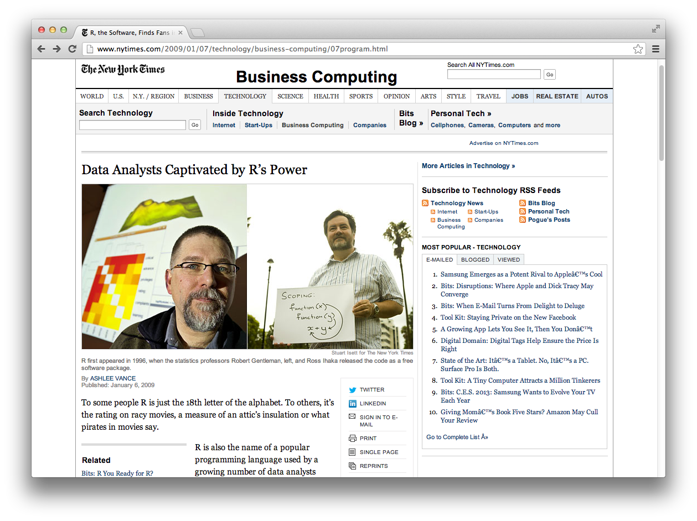
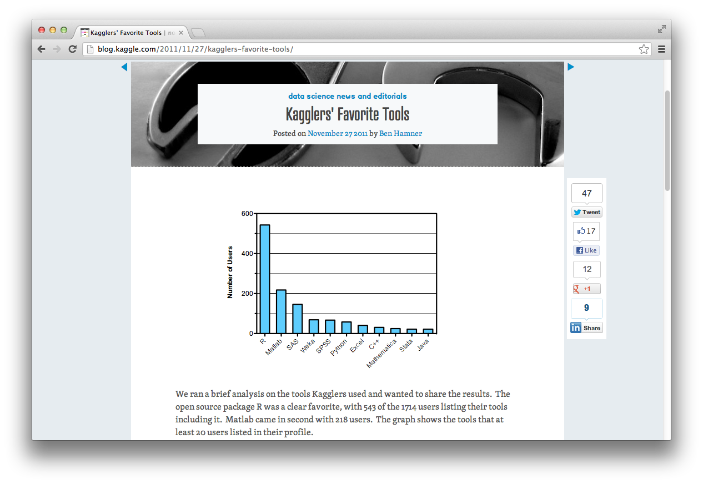
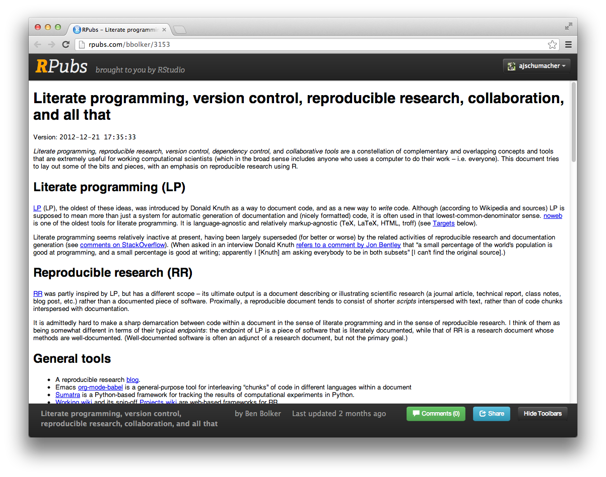
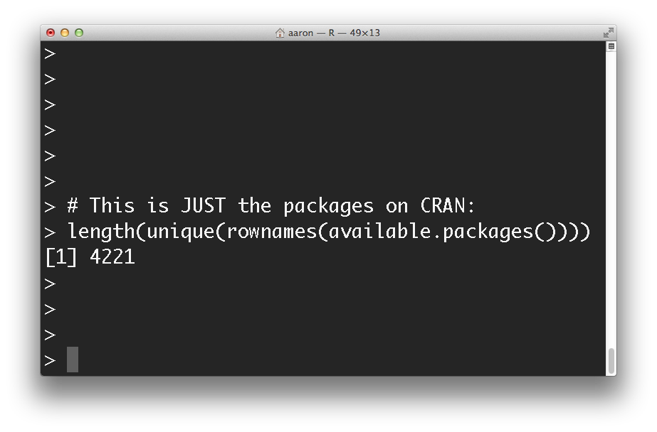
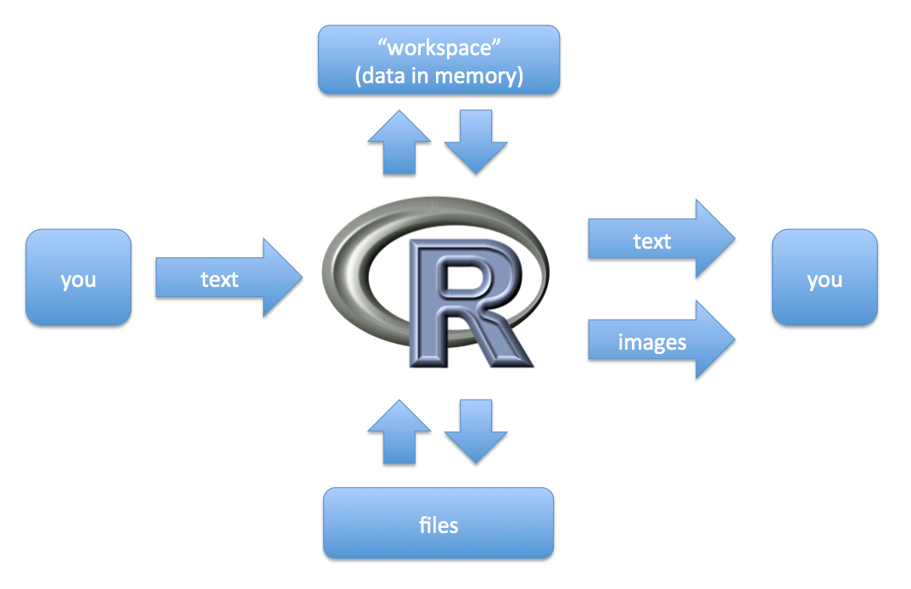

## Why use R?

* Open Source / Free
* Increasingly popular
* Powerful and Extensible
* Makes reproducible research easy, convenient and diverse visualization options, more statistics than you can shake a stick at, excellent for exploratory data analysis, many support options, often first for cutting-edge techniques, ...
* Available:
    * Download: [R](http://cran.r-project.org/mirrors.html) / [RStudio](http://www.rstudio.com/ide/download/)
    * Data Services lab, fifth floor Bobst
    * Most ITS labs
    * Virtual Computing Lab ([VCL](https://vcl.nyu.edu/)) (for students)
    * High Performance Computing ([HPC](https://wikis.nyu.edu/display/NYUHPC/High+Performance+Computing+at+NYU)) clusters (requires account)

---

<center>
 <a style='border-bottom:none;' href='http://www.nytimes.com/2009/01/07/technology/business-computing/07program.html'>
  
 </a>
</center>

---

<center>
 <a style='border-bottom:none;' href='http://blog.kaggle.com/2011/11/27/kagglers-favorite-tools/'>
  
 </a>
</center>

---

<center>
 <a style='border-bottom:none;' href='http://rpubs.com/bbolker/3153'>
  
 </a>
</center>

---

<center>
 <a style='border-bottom:none;' href='https://www.facebook.com/notes/facebook-engineering/visualizing-friendships/469716398919'>
  
 </a>
</center>

---

<center>
 <a style='border-bottom:none;' href='http://csgillespie.wordpress.com/2010/12/08/new-paper-survival-analysis/'>
  
 </a>
</center>

---

<center>
  
</center>

---

## Why not use R?

* It's not Excel.
* It's not Mathematica/Maple/etc.
* It's not SAS/Stata/SPSS/etc.
* It's not C.
* Defaults to in-memory.
* Often not best for building interactives.

---

## What is R?

<center></center>

---

## What is RStudio?

An Integrated Development Environment (IDE) for R. Check it out!
<center></center>

---

## Everything is a function.

Anything you want to do in R is done by telling R to run a function.

To run a function with no arguments, follow its name with parentheses.

```{r, eval=FALSE}
help()
```

Arguments are passed inside the parentheses. Arguments are usually named, but names can be omitted if it's unambiguous.

```{r, eval=FALSE}
help(topic=getwd)
help(getwd)
```

If you don't include parentheses, R will try to give you the function itself.

```{r, eval=FALSE}
help
help.search
```

---

## Everything is a function.

Even things that don't look like functions are functions.

```{r, tidy=FALSE}
c(5 + 7 == "+"(5, 7),       #  Even arithmetic is done by functions.
  all(1:10 == ":"(1, 10)))  #  Another useful 'infix' function.
```

Try this:

```{r, tidy=FALSE}
?"<-"       #  '?' is shorthand for 'help()'
"<-"(x, 5)  #  This will work.
y <- 8      #  This is what you'll always do.

# Okay, comments aren't functions.
```

---

## Everything is a vector.

```{r}
42:100
```

The numbers in brackets tell you the position in the vector at the start of the line. So:

```{r}
42
```

---

## Everything is a vector. Vector of what?

```{r, eval=FALSE}
class(TRUE); class(T); class(FALSE); class(F);              #  logical
class(1:10); class(42L);                                    #  integer
class(42); class(3.7); class(5e7); class(1/89)              #  numeric
class("Aaron"); class("cow"); class("123"); class("TRUE")   #  character

# And then there are these guys...
class(factor(c("red", "green", "blue")))                    #  factor
class(factor(c("medium", "small", "small", "large"),
             levels=c("small", "medium", "large"),
             ordered=TRUE))                                 #  ordered factor
```

Vectors have exactly one class, and are joined by the `c()` function.

```{r, eval=FALSE}
c(9, 7, TRUE, FALSE)
c(9, 7, TRUE, FALSE, "cow")
```

Other things: `NA` (missing), `NULL` (not a thing), `NaN` (`sqrt(-1)`), `Inf` (`1/0`).

---

## Vectorized Operations and Recycling

Most operations happen element-wise.

```{r}
c(1, 2, 3, 4) + c(100, 1000, 10000, 10000)
```

If the vectors have different lengths, they shorter one gets 'recycled'.

```{r}
c(1, 2, 3, 4) + c(100, 1000)
```

---

## Vectorized Operations and Recycling

What will happen with these?

```{r, eval=FALSE, tidy=FALSE}
c(1, 2) * c(4, 5, 6)

1 + 1:10

1:10 / 10

1:10 < 5
```

---

## Vectorized Operations and Recycling

```{r, eval=TRUE, tidy=FALSE}
c(1, 2) * c(4, 5, 6)
1 + 1:10
```

---

## Vectorized Operations and Recycling

```{r, eval=TRUE, tidy=FALSE}
1:10 / 10
1:10 < 5
```

---

## Things can have names.

```{r}
my.vector <- 1:5
my.vector
names(my.vector) <- c('a', 'b', 'c', 'd', 'e')  # don't be scared!
my.vector
```

---

## Selecting from vectors with `[ ]`

```{r, tidy=FALSE}
my.vector[c(2, 4)]                             # by index numbers
my.vector[c('c', 'e')]                         # by names
my.vector[c(TRUE, FALSE, TRUE, FALSE, TRUE)]   # with logicals
```

---

## Good things to do with vectors

```{r, tidy=FALSE}
length(my.vector)   #  How long is my vector?
sum(my.vector)      #  What if I add up the numbers in my vector?
sum(my.vector < 4)  #  Alternative: length(my.vector[my.vector < 4])
```

---

## Super-vectors

* Matrices are vectors with a number of columns and a number of rows, which should all jive.
    * Multiplication is element-wise for `*`, matrix-wise for `%*%`.
* Lists are like vectors where each element could be itself a vector.
    * Compare `c(1:3, 4)` with `list(1:3, 4)`.
* Data frames are lists with every vector equal length, and you get row names and column names.

```{r}
(my.data <- read.csv('http://bit.ly/NYUdataset'))
```

---

## Working with data frames

```{r, eval=FALSE}
str(my.data)
summary(my.data)
```

You can access a particular vector in a list or data frame in several ways:

```{r, eval=FALSE}
my.data$gender
my.data[[2]]
my.data[['gender']]
with(my.data, gender)
```

You can subset using `[column(s), row(s)]`, both parts just like selecting from a single vector.

```{r}
my.data[2, 'age']
```

---

## Working with data frames?

How can we select the `time`s for females?

---

## Working with data frames!

How can we select the `time`s for females?

```{r, eval=FALSE}
my.data[my.data$gender=='F', "time"]
```

Compare with the `subset()` function:

```{r, eval=FALSE}
subset(my.data, gender=='F', select="time")
```

---

## Working with data frames

To add / compute / make a new column, just assign to it:

```{r}
my.data$number.five <- 5
my.data$mean.1.2 <- my.data$health1 + my.data$health2
my.data$health <- rowMeans(my.data[5:10])
```

To drop / delete / remove a column, you have options:

```{r, tidy=FALSE}
my.data$number.five <- NULL         #  remove from the data frame 'in place'
my.new.data <- my.data[1:10]        #  make a new smaller data frame
my.new.data <- my.data[-c(11,12)]   #  same as last
```

---

## Some Statistics

```{r, eval=FALSE}
mean(my.data$age)
sd(my.data$age)
cor(my.data[5:10])
table(my.data$gender)
table(my.data$health3, my.data$gender)
chisq.test(my.data$health3, my.data$gender)
with(my.data, t.test(health1, health2))
my.model <- lm(health1 ~ age + gender, data=my.data)
summary(my.model)
confint(my.model)
aov(my.model)
aov(health1 ~ age + gender, data=my.data)
```

---

## Base graphics

```{r, eval=FALSE}
with(my.data, barplot(table(gender)))
plot(my.data$age)
hist(my.data$age)
hist(my.data$age, col='cornflowerblue', breaks=20, xlab='Age', main='Participants')
boxplot(my.data$age)
with(my.data, boxplot(age ~ gender))
with(my.data, plot(health1, health2))
with(my.data, plot(health1, health2, pch=19))
with(my.data, plot(jitter(health1), jitter(health2)))
with(my.data, plot(jitter(health1), jitter(health2), pch=20, col=rainbow(15), xlab='Monkeys eaten', ylab='Number of cheeses', main='Absolute Power (Ninjas)'))
pairs(my.data[5:10])
plot(my.model)
```

---

## More!

There are many packages available on the Comprehensive R Archive Network ([CRAN](http://cran.r-project.org/)) which can be easily installed and loaded into R. One very popular package is `ggplot2`, a graphing library.

```{r, eval=FALSE, tidy=FALSE}
install.packages('ggplot2')  # Do this once per machine.
library(ggplot2)             # Do this once per R session.
```

After installing and loading a package, you can use the functions it provides.

```{r, fig.align='center', fig.height=2.6, fig.width=5}
qplot(x=carat, y=price, color=cut, data=diamonds) + theme_bw()
```

---

## Thank you! Questions! Survey!

<center>
### [http://bit.ly/NYUintroRsurvey](http://bit.ly/NYUintroRsurvey)
</center>
