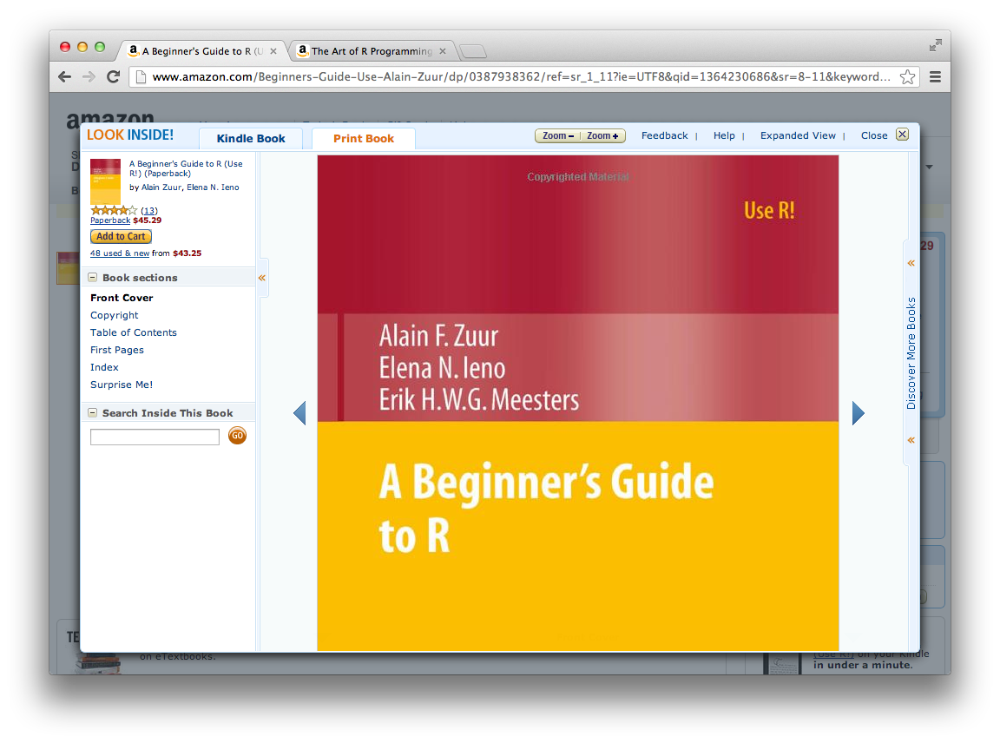

---

title       : Introduction to R
subtitle    : bit.ly/NYUintroR
author      : Aaron Schumacher
job         : Senior Data Services Specialist
biglogo     : data_services_logo.png
framework   : io2012        # {io2012, html5slides, shower, dzslides, ...}
highlighter : highlight.js  # {highlight.js, prettify, highlight}
hitheme     : tomorrow      # {tomorrow, solarized_light}
widgets     : []            # {mathjax, quiz, bootstrap}
mode        : selfcontained # {standalone, draft}
license     : by-nc-sa
github:
  user: ajschumacher
  repo: Introduction_to_R

--- &twocol

```{r setup, echo=FALSE,message=FALSE}
library(ggplot2)
set.seed(42)
options(repos='http://lib.stat.cmu.edu/R/CRAN/')
```

## [NYU Data Services](http://bit.ly/nyudataservices)

*** left

* [Computer lab, Bobst 5](http://nyu.libguides.com/content.php?pid=38898&sid=1496756)
* [Workshops/Tutorials](http://bit.ly/datatutorials)
* [Individual consultations](http://bit.ly/datameeting)

*** right

* ArcGIS
* Google Earth
* SPSS
* Stata
* SAS
* R
* MATLAB
* ATLAS.ti
* Qualtrics Surveys
* High Performance Computing
* Data Finding
* Data Management Planning

--- &twocol

## Introduction to R

*** left

* Why use R?
* What is R / RStudio?
* Everything is a function.
* Everything is a vector.
* Data Frames are useful.
* Some statistics
* Base graphics
* More!
* Further resources

*** right

* Please ask questions!
* Please fill out our [survey](http://bit.ly/NYUintroRsurvey) afterward!

---

## Why use R?

* Open Source / Free
* Increasingly popular
* Powerful and Extensible
* Makes reproducible research easy, convenient and diverse visualization options, more statistics than you can shake a stick at, excellent for exploratory data analysis, many support options, often first for cutting-edge techniques, ...
* Available:
    * Download: [R](http://cran.r-project.org/mirrors.html) / [RStudio](http://www.rstudio.com/ide/download/)
    * Data Services lab, fifth floor Bobst
    * Most ITS labs
    * Virtual Computing Lab ([VCL](https://vcl.nyu.edu/)) (for students)
    * High Performance Computing ([HPC](https://wikis.nyu.edu/display/NYUHPC/High+Performance+Computing+at+NYU)) clusters (requires account)

---

<center>
 <a style='border-bottom:none;' href='http://www.nytimes.com/2009/01/07/technology/business-computing/07program.html'>
  
 </a>
</center>

---

<center>
 <a style='border-bottom:none;' href='http://blog.kaggle.com/2011/11/27/kagglers-favorite-tools/'>
  
 </a>
</center>

---

<center>
 <a style='border-bottom:none;' href='http://rpubs.com/bbolker/3153'>
  
 </a>
</center>

---

<center>
 <a style='border-bottom:none;' href='https://www.facebook.com/notes/facebook-engineering/visualizing-friendships/469716398919'>
  
 </a>
</center>

---

<center>
 <a style='border-bottom:none;' href='http://csgillespie.wordpress.com/2010/12/08/new-paper-survival-analysis/'>
  
 </a>
</center>

---

## Additional packages for R

The Comprehensive R Archive Network (CRAN) hosts this many packages.

This is as of ``r date()``.

```{r}
length(unique(rownames(available.packages())))
```

And there are many more in addition to the ones on CRAN.

---

## Why not use R?

* It's not Excel.
* It's not Mathematica/Maple/etc.
* It's not SAS/Stata/SPSS/etc.
* It's not C.
* Defaults to in-memory.
* Often not best for building interactives.

---

## What is R?

<center></center>

---

## What is RStudio?

An Integrated Development Environment (IDE) for R. Check it out!
<center></center>

---

## Everything is a function.

Anything you want to do in R is done by telling R to run a function.

To run a function with no arguments, follow its name with parentheses.

```{r, eval=FALSE}
help()
```

Arguments are passed inside the parentheses. Arguments are usually named, but names can be omitted if it's unambiguous.

```{r, eval=FALSE}
help(topic=getwd)
help(getwd)
```

If you don't include parentheses, R will try to give you the function itself.

```{r, eval=FALSE}
help
help.search
```

---

## Everything is a function.

Even things that don't look like functions are functions.

```{r, tidy=FALSE}
5 + 7
"+"(5,7)
```

Arithmetic operations are functions.

---

## Everything is a function.

Even things that don't look like functions are functions.

```{r, tidy=FALSE}
":"(1,10)
1:10
```

This is a super handy function! It returns a vector.

---

## Everything is a function.

Convenient short-hand is available for other functions too. Get help fast:

```{r, tidy=FALSE, eval=FALSE}
?glm             #  This is identical to: help(glm)
```

And of course, assign things to variables:

```{r, tidy=FALSE, eval=FALSE}
my.object <- 8   #  You will never see the equivalent: "<-"(my.object, 8)


# Okay, comments aren't functions.
```

---

## Everything is a vector.

```{r}
42:100
```

The numbers in brackets tell you the position in the vector at the start of the line. So:

```{r}
42
```

---

## `c()` is a function that combines vectors

```{r, eval=FALSE, tidy=FALSE}
2, 4      #  this will fail

c(2, 4)   #  this will make a vector containing first 2 then 4
```

Very often you will want to pass one vector as an argument to a function.

```{r, tidy=FALSE, eval=FALSE}
mean(2, 4)      #  this passes the function two arguments,
                #   a vector containing 2 and a vector containing 4

mean(c(2, 4))   #  this passes the function one argument,
                #   a vector containing first 2 then 4
```

This kind of thing is common in R and an easy way to make a mistake.

---

## Everything is a vector. Vector of what?

```{r, eval=FALSE}
class(TRUE); class(T); class(FALSE); class(F);              #  logical
class(1:10); class(42L);                                    #  integer
class(42); class(3.7); class(5e7); class(1/89)              #  numeric
class("Aaron"); class("cow"); class("123"); class("TRUE")   #  character

# And then there are these guys...
class(factor(c("red", "green", "blue")))                    #  factor
class(factor(c("medium", "small", "small", "large"),
             levels=c("small", "medium", "large"),
             ordered=TRUE))                                 #  ordered factor
```

Vectors have exactly one class, and are joined by the `c()` function.

```{r, eval=FALSE}
c(9, 7, TRUE, FALSE)
c(9, 7, TRUE, FALSE, "cow")
```

Other things: `NA` (missing), `NULL` (not a thing), `NaN` (`sqrt(-1)`), `Inf` (`1/0`).

---

## Vectorized Operations and Recycling

Most operations happen element-wise.

```{r}
c(1, 2, 3, 4) + c(100, 1000, 10000, 10000)
```

If the vectors have different lengths, they shorter one gets 'recycled'.

```{r}
c(1, 2, 3, 4) + c(100, 1000)
```

---

## Vectorized Operations and Recycling

What will happen with these?

```{r, eval=FALSE, tidy=FALSE}
c(1, 2) * c(4, 5, 6)

1 + 1:10

1:10 / 10

1:10 < 5
```

---

## Vectorized Operations and Recycling

```{r, eval=TRUE, tidy=FALSE}
c(1, 2) * c(4, 5, 6)
1 + 1:10
```

---

## Vectorized Operations and Recycling

```{r, eval=TRUE, tidy=FALSE}
1:10 / 10
1:10 < 5
```

---

## Things can have names.

```{r}
my.vector <- 101:105
my.vector
names(my.vector) <- c('a', 'b', 'c', 'd', 'e')  # don't be scared!
my.vector
```

---

## Selecting from vectors with `[ ]`

```{r, tidy=FALSE}
my.vector[c(2, 4)]                             # by index numbers
my.vector[c('c', 'e')]                         # by names
my.vector[c(TRUE, FALSE, TRUE, FALSE, TRUE)]   # with logicals
```

---

## Using logical selection

```{r}
(my.numbers <- sample(1:10, 20, replace=TRUE))
```

How can we get just the entries less than five?

---

## Using logical selection

```{r}
my.numbers < 5
my.numbers[my.numbers < 5]
```

---

## Good things to do with vectors

```{r, tidy=FALSE}
length(my.vector)   #  How long is my vector?
sum(my.vector)      #  What if I add up the numbers in my vector?
sum(my.vector < 4)  #  Alternative: length(my.vector[my.vector < 4])
```

---

## Data Frames are useful.

* Matrices are vectors with a number of columns and a number of rows, which should all jive.
    * Multiplication is element-wise for `*`, matrix-wise for `%*%`.
* Lists are like vectors where each element could be itself a vector.
    * Compare `c(1:3, 4)` with `list(1:3, 4)`.
* Data frames are lists with every vector equal length, and you get row names and column names.

```{r}
(my.data <- read.csv('http://bit.ly/NYUdataset'))
```

---

## Working with data frames

```{r, eval=FALSE}
str(my.data)
summary(my.data)
```

You can access a particular vector in a list or data frame in several ways:

```{r, eval=FALSE}
my.data$gender
my.data[[2]]
my.data[['gender']]
with(my.data, gender)
```

You can subset using `[row(s), column(s)]`, both parts just like selecting from a single vector.

```{r}
my.data[2, 'age']
```

---

## Working with data frames?

How can we select the `time`s for females?

---

## Working with data frames!

How can we select the `time`s for females?

```{r, eval=FALSE}
my.data[my.data$gender=='F', "time"]
```

Other options:

```{r, eval=FALSE}
my.data$time[my.data$gender=='F']

subset(my.data, gender=='F', select="time")
```

---

## Working with data frames

To add / compute / make a new column, just assign to it:

```{r}
my.data$number.five <- 5
my.data$mean.1.2 <- my.data$health1 + my.data$health2
my.data$health <- rowMeans(my.data[5:10])
```

To drop / delete / remove a column, you have options:

```{r, tidy=FALSE}
my.data$number.five <- NULL         #  remove from the data frame 'in place'
my.new.data <- my.data[1:10]        #  make a new smaller data frame
my.new.data <- my.data[-c(11,12)]   #  same as last
```

---

## Some Statistics

```{r, eval=FALSE}
mean(my.data$age)
sd(my.data$age)
cor(my.data[5:10])
table(my.data$gender)
table(my.data$health3, my.data$gender)
chisq.test(my.data$health3, my.data$gender)
with(my.data, t.test(health1, health2))
my.model <- lm(health1 ~ age + gender, data=my.data)
summary(my.model)
confint(my.model)
aov(my.model)
aov(health1 ~ age + gender, data=my.data)
```

---

## Base graphics

```{r, eval=FALSE}
with(my.data, barplot(table(gender)))
plot(my.data$age)
hist(my.data$age)
hist(my.data$age, col='cornflowerblue', breaks=20, xlab='Age', main='Participants')
boxplot(my.data$age)
with(my.data, boxplot(age ~ gender))
with(my.data, plot(health1, health2))
with(my.data, plot(health1, health2, pch=19))
with(my.data, plot(jitter(health1), jitter(health2)))
with(my.data, plot(jitter(health1), jitter(health2), pch=20, col=rainbow(15), xlab='Monkeys eaten', ylab='Number of cheeses', main='Absolute Power (Ninjas)'))
pairs(my.data[5:10])
plot(my.model)
```

---

## More!

There are many packages available on the Comprehensive R Archive Network ([CRAN](http://cran.r-project.org/)) which can be easily installed and loaded into R. One very popular package is `ggplot2`, a graphing library.

```{r, eval=FALSE, tidy=FALSE}
install.packages('ggplot2')  # Do this once per machine.
library(ggplot2)             # Do this once per R session.
```

After installing and loading a package, you can use the functions it provides.

```{r, fig.align='center', fig.height=2.6, fig.width=5}
qplot(x=carat, y=price, color=cut, data=diamonds) + theme_bw()
```

---

## Further independent resources on R

* [Try R](http://tryr.codeschool.com/): A free online interactive tutorial
* [A Beginners Guide to R](http://www.amazon.com/Beginners-Guide-Use-Alain-Zuur/dp/0387938362/) (book)
* [The Art of R Programming](http://www.amazon.com/The-Art-Programming-Statistical-Software/dp/1593273843/) (book)

---

<center>
 <a style='border-bottom:none;' href='http://tryr.codeschool.com/'>
  
 </a>
</center>

---

<center>
 <a style='border-bottom:none;' href='http://www.amazon.com/Beginners-Guide-Use-Alain-Zuur/dp/0387938362/'>
  
 </a>
</center>

---

<center>
 <a style='border-bottom:none;' href='http://www.amazon.com/The-Art-Programming-Statistical-Software/dp/1593273843/'>
  
 </a>
</center>

---

## The source for this presentation

<iframe src="index.txt" height=600px /></iframe>

---

## Thank you! Questions! Survey!

<center>
### [http://bit.ly/NYUintroRsurvey](http://bit.ly/NYUintroRsurvey)
</center>
